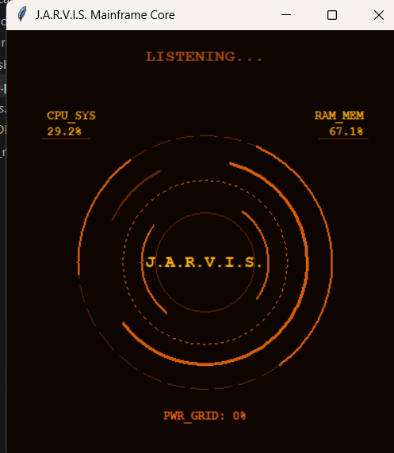

## Progress: Desktop Voice Assistant (JARVIS)

I built a fully functional, hands-free **Desktop Voice Assistant** inspired by JARVIS. The assistant runs on a background thread while displaying an interactive, animated graphical User Interface (HUD).

- **Voice & Speech Recognition:** Combined `speech_recognition` (Google API) and `pyttsx3` to create a continuous voice-controlled loop that processes spoken phrases into executive commands and speaks back answers.

- **System Diagnostics & Control:** Integrated `psutil`, `platform`, and `ctypes` to fetch runtime stats (CPU, RAM, Battery) and query system specifications using specialized administrator access privileges.

- **Production Git Automation:** Programmed a custom continuous delivery feature using Python's `subprocess` pipeline to automatically stage modifications, register a verbal commit message, and securely push changes upstream to production repositories.

- **Local File Database:** Created an asynchronous logger file subsystem (`notes.txt`) that lets the user capture timestamped notes, clear entries, read lines, and perform structural payload deletions using voice feedback hooks.

- **Web Integrations & APIs:** Hooked into the OpenWeatherMap API for live location reports, standard `webbrowser` paths for fast navigation, and the Wikipedia API wrapper for quick educational data summaries.

